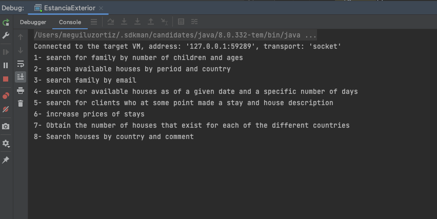

# Estacian_Exterior
El objetivo es el desarrollo del sistema de reserva de casas para realizar estancias en el exterior, utilizando el lenguaje JAVA, una base de datos MySQL y JDBC para realizar la ejecución de operaciones sobre la base de datos

La base de datos es MYSQL, y se debe importar y cambiar las claves(por las que usted utiliza) en la clase DAO para que pueda ser realizada la conexión.
IMPORTANTE!
hacer la conexión de DRIVER jdbc

Sobre el proyecto:

Versión terminada para revisar con menú por consola.

Se tomó en cuenta que la base de datos estaba en castellano, los nombres de las filas y columnas de la base de datos, se trató como si fueran nombres propios.
En java  a la hora de hacer creaciones de servicios objetos y métodos, los nombres no se cambiaron.


Se tomó de ejemplo los siguientes Ejercicios que se debían hacer con esta base de datos y jdbc;

1) Listar aquellas familias que tienen al menos 3 hijos, y con edad máxima inferior a 10 años.
2) Buscar y listar las casas disponibles para el periodo comprendido entre el 1 de agosto de
2020 y el 31 de agosto de 2020 en Reino Unido.
3) Encuentra todas aquellas familias cuya dirección de mail sea de Hotmail.
4) Consulta la BD para que te devuelva aquellas casas disponibles a partir de una fecha dada
y un número de días específico.
5) Listar los datos de todos los clientes que en algún momento realizaron una estancia y la
descripción de la casa donde la realizaron.
6) Debido a la devaluación de la libra esterlina con respecto al euro se desea incrementar el
precio por día en un 5% de todas las casas del Reino Unido. Mostar los precios
actualizados.
7) Obtener el número de casas que existen para cada uno de los países diferentes.
8) Busca y listar aquellas casas del Reino Unido de las que se ha dicho de ellas (comentarios)
que están ‘limpias’.

Teniendo en cuenta estos ejercicios a realizar, me tome la libertad de hacerlos más genéricos y que el usuario pueda insertar datos acordes a la necesidad, pero respetando el objetivo de cada ejercicio.

## Imagenes



Presionar la opci&oacute;n 1.
```(shell)
1
```

El resultado a mostrar debe ser similar al siguiente